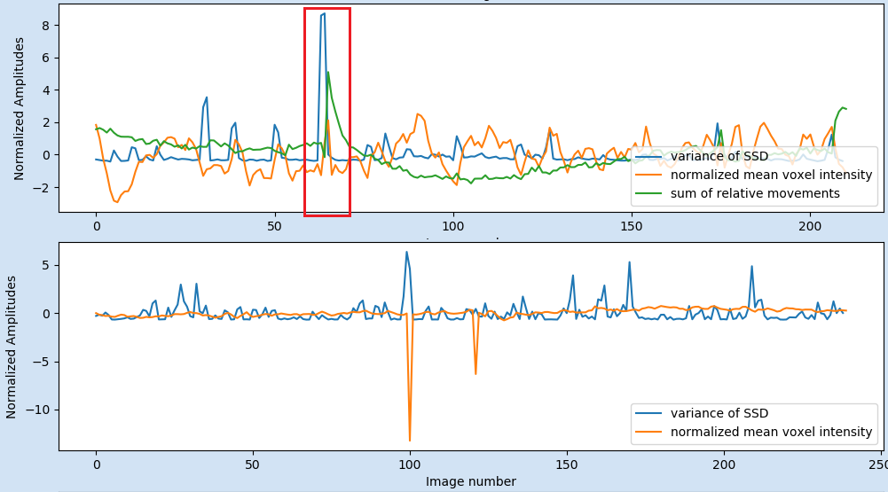
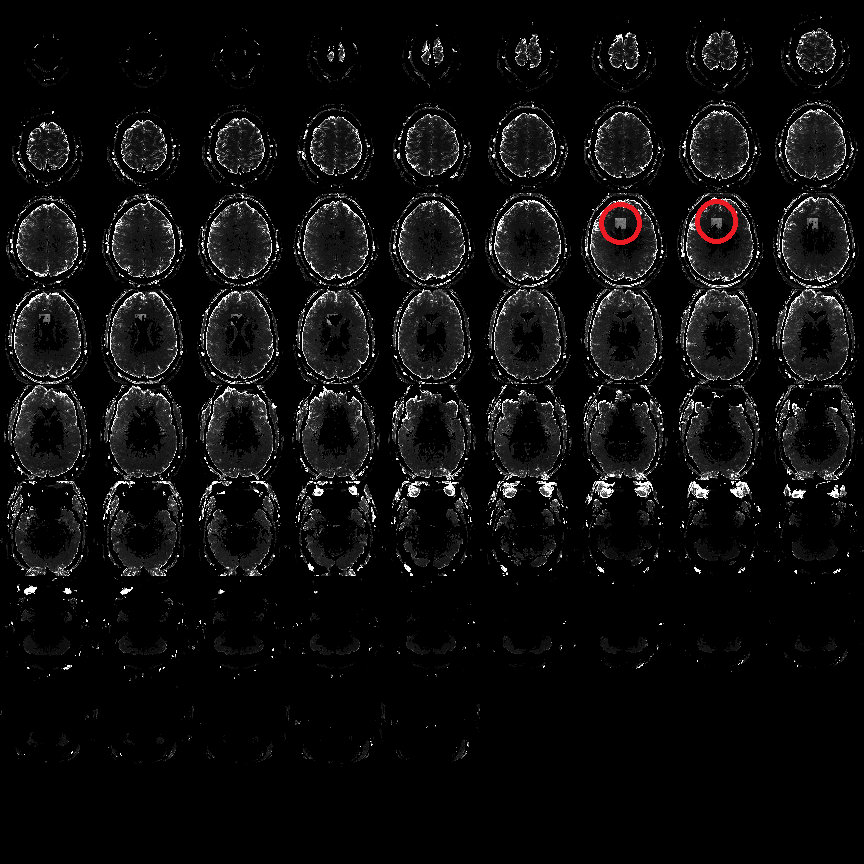

# pyfMRIqc User Manual

<br>
___

### Content

[About pyfMRIqc](#about-pyfmriqc) <br>
[License](#license)<br>
[Installation](#installation)<br>
[Usage](#usage)<br>
[Measures and Output files](#measures-and-output-files)<br>
[html Output Guidelines](#html-output-guidelines)<br>
&nbsp;&nbsp;&nbsp; [Input parameter](#input-parameter)<br>
&nbsp;&nbsp;&nbsp;[Scan parameter](#scan-parameter)<br>
&nbsp;&nbsp;&nbsp;[QC plots](#qc-plots)<br>
&nbsp;&nbsp;&nbsp;[Mean voxel time course of bins with equal number of voxels](#mean-voxel-time-course-of-bins-with-equal-number-of-voxels)<br>
&nbsp;&nbsp;&nbsp;[Mean voxel intensity](#mean-voxel-intensity)<br>
&nbsp;&nbsp;&nbsp;[Masks](#masks)<br>
&nbsp;&nbsp;&nbsp;[Variance of voxel intensity](#variance-of-voxel-intensity)<br>
&nbsp;&nbsp;&nbsp;[Signal to noise ratio](#signal-to-noise-ratio)<br>
&nbsp;&nbsp;&nbsp;[Sum of squared scaled differences over time](#sum-of-squared-scaled-differences-over-time)<br>
&nbsp;&nbsp;&nbsp;[Motion parameter summary](#motion-parameter-summary)<br>
[Example files](#example-files)


<br>
___

# About pyfMRIqc
pyfMRIqc is an open-source software that provides the user the possibility to check the quality of function magnetic resonance imaging (fMRI) data. This tool is designed to check the raw data before preprocessing and analysis. pyfMRIqc provides an overview of fMRI data quality and can be used to identify potential problems in data quality. It does NOT provide an automatic decision if the data is usable or not!

pyfMRIqc is entirely written in Python and is nearly platform independent and can be used by the majority of individuals in the neuroimaging community. Because pyfMRIqc is a user-friendly tool it is suitable for neuroscientists at all stages of their career and can be used for quality checking for both individual datasets or can be implemented into automatic pipelines for data quality checking immediately after scanning.

**AUTHORS:** <br>
Michael Lindner and Brendan Williams <br>
University of Reading, 2019<br>
School of Psychology and Clinical Language Sciences<br>
Center for Integrative Neuroscience and Neurodynamics

[Go to top](#content)

<br>
___
# License
pyfMRIqc is freely available for distribution and/or modification under the terms of the GNU General Public License (GPLv3) as published by the Free Software Foundation. The software is developed using Python 3. 

pyfMRIqc is developed by Michael Lindner and Brendan Williams at the Centre for Integrative Neuroscience and Neurodynamics at the University of Reading. This software is distributed in the hope that it will be useful, but without warranty. 

This tool does not make an automatic decision about the quality of your data and is instead indented to be used as a guide for inspecting your raw data in detail before preprocessing and analysis. The responsibility is still with the user to decide whether to use their data or not. 

  

[Go to top](#content)

# Installation
## Install
pyfMRIqc is entirely written in Python 3.6.
Copy the pyfMRIqc folder in a folder of your choice on your system and optionally add the directory to your PYTHONPATH. 

## Dependencies
pyfMRIqc is available for Python 3 (developed and tested using version 3.6.4) and requires the following packages (developed with these versions):

* nibabel (2.2.1)
* numpy (1.14.3)
* matplotlib (2.1.0)
* scipy (0.19.1)
* easygui (0.98.1) 

[Go to top](#content)

<br>
___

# Usage

pyfMRIqc can be used with a GUI (for beginners or for testing a single data set) or with command line parameters (recommended usage - for advanced users, multiple datasets or adding to a pipeline)
The GUI input version of pyfMRIqc needs to be started without any input parameters:

```
python pyfMRIqc.py 
```

For the command line input the following parameter can be specified. (Some of these input parameters are exclusive for the command line parameter input and not available via the GU):

	-n:   functional MR nifti file (<functional_file_path/functional_file_name.nii>)
	-s:   percentage of voxel with the lowest values (outside the mask) for SNR calculation (scalar value)
	either 
		-t:   threshold of minimum mean values of voxel that should be included in the quality check (scalar value)
	or
		-k:   binary nifti mask file of voxel that should be included in the quality check 					(<mask_file_path/mask_file_name>)
	optional:
	-o:   output directory (path)
	-m:   motion parameters file of motion correction from FSL (*.par), SPM (rp*.txt) or AFNI (*.1D). 			(<motion_file_path/motion_file_name>)
	-x: if -x is set the 3D and 4D nifti output files are not saved
	-h, --help (This input will print the pyfMRIqc input help to the command window) 

For example:

```
python pyfMRIqc.py -n <your_functional_file_path/your_functional_file.nii> -s 10 -k <your_mask_file_path/your_mask_file.nii > -m <your_motion_file_path/your_motion_file> -x -o <your_output_path>
```

This would execute pyfMRIqc for your_functional_file.nii from the directory your_functional_file_path. The mask your_mask_file.nii from the directory your_mask_file_path would be applied to your_functional_file.nii, a value of 10% would be used for SNR calculation and your_motion_file would be loaded from your_motion_file_path. pyfMRIqc output data would be saved to your_output_path and additional nifti files would not be saved as part of your output. 

[Go to top](#content)

<br>
___

# Measures and output files

## Mean
The mean voxel intensity over time can be used to see if there is any general signal loss. 
pyfMRIqc provides 3D nifti and a 2D .png overview image as output for the mean voxel intensity.

[Go to top](#content)

## Mean voxel time course of bins with equal number of voxels
For this output voxels are sorted depending on their mean voxel time course intensity and then divided into 50 bins with an equal number of voxels each bin. Then the voxels are averaged per volume in each bin. Each horizontal line represents the averaged voxel time course of one bin. The bins are sorted ascending (top-down) depending on the mean voxel intensity, so that the upper part of the bins represents voxels outside the brain, lower middle parts grey matter and lower parts voxels in the white matter. 
This image is meant to detect unexpected or unwanted changes in the signal variance as described in Power (2016). Prominent vertical patterns in this image can be related to different types of issues such as motion, respiratory, signal loss or different types of noise and artefacts. It can also help to identify if an issue is global (from top to bottom) or only related to some of the tissue types (vertical pattern in subparts). Additionally, the user can check, if any known effect (such as motion – known from the motion plot) influences the signal change or not.
pyfMRIqc provides 2D .png image as output for the mean voxel time course of bins.

[Go to top](#content)

## Output mask files: “Mask” and “Mask for SNR”
pyfMRIqc creates two output .nii files containing binary masks:
1)	Mask: depending on the user input:
a.	containing voxels with higher intensity values than given threshold t
b.	same mask as the input mask as input k
2)	Mask for SNR: containing s percentage of voxel with the lowest values depending on input -s

[Go to top](#content)

## Variance
The variance over time are calculate voxel-wise. By default, the grey matter, brain stem and blood vessels have the highest variability of BOLD signal. Therefore, these tissue types have higher values and are brighter in this image (nifti and 2D). Sudden or unexpected signal changes such as artefacts, signal changes, motion etc. in one or a few volumes will increase the variance and therefore will be detectable in these images. E.g. a local signal dropout in a few volumes will become a grey pattern in the image. 

pyfMRIqc provides 3D nifti and a 2D .png overview image as output for the variance (For better visualization the scaled variance in the 2D .png image is thresholded to minimize the scaling effect of large outliers (Threshold value is mentioned in the html and filename of the image).).

[Go to top](#content)

## Scaled squared difference
For the scaled squared difference (SSD), the first derivative of the time course `q=dx/dt` with dt = 1 is calculated. Which leads to the difference of two consecutive time points `t - (t-1)` of each voxel (V). These differences are then squared. To take the differences in absolute signal intensity into account the squared differences are divided by the mean of squared differences of all voxel (M): `SSDt = (Vt – Vt-1)2/M`

The scaled variability can be used to detect sudden changes in signal intensity which can occur because of different problems, E.g. 

* signal loss or artefact – in these cases the “continuous” voxel time course signal is interrupted by sudden extreme low or high values. Then, the scaled variability would show a massive positive or negative peak.
* head motion – in this case at the time point the motion occurs the voxel time course of a spatially defined brain tissue is interrupted and continued with the signal of another brain tissue. In this case the scales variability will show either a peak or step (positive or negative).
pyfMRIqc provides 3D nifti and a 2D .png overview image as output for the SSD.

[Go to top](#content)

## Signal-to-noise ratio 
For calculating the signal-to-noise ratio (SNR) the mean voxel intensity of each voxel is divided by the standard deviation of mean of the noise. In pyfMRIqc the mean noise is defined as the average of the s% of voxel having the lowest mean intensity, where s is dependent on the user input (-s). pyfMRIqc provides a 3D nifti image with voxel-wise SNR values and a summary of values as output for the SNR.
The Slice SNRs measures the time course SNR averaged across each slice, and Mean voxel SNR is the average over all the slices together. The higher the SNR, the smaller the relative fluctuations and more stable is the signal over repeated measurements. The SNR provides an estimate of the reliability (~ reproducibility) of fMRI data and serves as a general goodness measure. 
Html output file guide

[Go to top](#content)

<br>
___

# html Output Guidelines

The pyfMRIqc html output provides an overview of your data and can be used to identify potential problems in data quality.

## Input parameter
The input parameter section of pyfMRIqc defines the input parameters that were defined for the quality control check. Please note, if ‘Threshold Value’ is defined, ‘Mask file’ cannot be defined and vice versa.

* Functional file - Functional 4D .nii file checked by the tool.
* Motion file - motion correction file from FSL/SPM (optional).
* Threshold Value - Value used to segment the functional image based on average signal voxel-wise, where any voxels below the specified threshold are masked (optional).
* Mask file - .nii mask used to segment the functional image (optional).
* SNR threshold - Percentile of total number of voxels in the functional image where values are used to calculate signal to noise ratio. If no value is specified, 5% is used as default.

[Go to "html Output Guidelines"](#html-output-guidelines)<br>
[Go to top](#content)


## Scan parameter
The scan parameter section of pyfMRIqc defines the sequence parameters of the functional file loaded into pyfMRIqc.

* Slice Dimensions - Size of the image matrix for each slice in the functional file.
* Number of Slices - Number of slices in each volume in the functional file.
* Number of Volumes - Total number of volumes in the functional file.
* Voxel Size - Dimensions of each voxel in millimetres (x*y*z)
* Total Number of Voxels - Number of voxels in each volume of the functional file.

[Go to "html Output Guidelines"](#html-output-guidelines)<br>
[Go to top](#content)

## QC plots
### QC subplot 1
The first QC plot shows the mean of the scaled squared difference (SSD) (see measures) over all voxel in the mask. To get an overview of any global signal change differences.

Any prominent peak (see example below) in this plot is related to a (global) sudden and drastic change in signal intensity, which can occur because of different reasons, e.g. 

* Signal loss or artefacts – in these cases the “continuous” voxel time course is interrupted by sudden extreme low or high values. Then, the scaled variability would show a massive positive or negative peak.
* Head motion – in this case at the time point the motion occurs the voxel time course of a spatially defined brain tissue is interrupted and continued with the signal of another brain tissue. In this case, the scales variability will show either a peak or step (positive or negative). In this case, these peaks highly correlate with the green line in plot 3 (see below).

Please keep in mind that this plot is “only” the mean over all voxel in the mask to give an overview of global changes. Local signal change issues can be inspected in the 4D nfiti file pfMRIqc_scaled_squared_diff_...nii


Fig 1: Examples of the first plot: A) shows peaks related to global signal intensity loss in two volumes (from example file pyfMRIqc\_example\_volume\_intensity\_loss.nii.gz) B) showing two peaks related to motion (from example file pyfMRIqc\_example\_motion.nii.gz). First strong movement after volume 65 and another small movement after volume 175. 

### QC subplot 2
The second QC plot shows the mean of the scaled squared difference (SSD) (see measures) for each slice separately. Each coloured plot in the figure represents one slice. In contrast to the first plot signal changes can be detected slice-wise and gives an overview of non-global sudden signal changes. If only one or a few slices show peaks it is recommended to thoroughly inspect the 4D nfiti file pfMRIqc_scaled_squared_diff_...nii to check for local issues such as artefacts, signal losses, etc.


Fig 2: Examples of the second plot of global vs local effects: A) Showing two peaks related to motion which effect all slices (from example file pyfMRIqc\_example\_motion.nii.gz). B) shows peaks related to global signal intensity loss in two volumes which only effect a few slices (from example file pyfMRIqc\_example\_local\_signal\_loss.nii.gz) 

### QC subplot 3
The third QC plot shows:


1. Normalised average of the demeaned voxel intensity of each volume. (First, each voxel time course is divided by its mean. Then all voxels are averaged for each volume. Then the averaged time course is z-scored.) 
2. Normalised variance of the scaled squared difference (SSD) (see measures) over all voxel in the mask.
3. (only if motion file was specified as input): Normalized sum of relative movement (sum of all relative motion translations and rotations.).
 
In this plot e.g. the relation between global signal changes and the motion can easily detected in terms of common peaks of all three or at least variance and motion plots (see example figure below). Additionally, in comparison the variance plot allows to visualise the presence of extreme values (or fluctuations) that could be cancelled out (by oppositely extreme values) in the mean and therefore will not be detected in the first plot. Due to the normalised values, the QC plot of multiple dataset can be directly compared.



Fig 3: Examples of the third plot: A) In the red box the plot shows that the variance of the SSD (blue line) is related to the head motion of the participant (green line). This plot from example file pyfMRIqc\_example\_motion.nii.gz. B) The negative peaks in the mean voxel intensity are related to global signal intensity loss in two volumes in the example file pyfMRIqc\_example\_volume\_intensity\_loss.nii.gz.

### QC subplot 4
The fourth QC plot displays the minimum, mean and maximum slice-wise scaled squared difference (SSD) averaged over volumes. This will pick up any slices with high SSD, such as occurs with slice dropout. Fairly typical: relatively high max SSD in lower slices, which include the eyes, brainstem etc. 


Fig 4: Examples of the fourth plot: A) Showing two peaks in the maximum scaled squared difference (SSD). While the first one (slices 12-20) is normal, because these slices are going through the eyes and brain stem, the second one (slices 36-45) is not normal and is related to the local signal loss in example file pyfMRIqc\_example\_local\_signal\_loss.nii.gz. B) The positive peak of the max SSD in B, is normal, because these slices are going through the eyes and brain stem the negative peak (low values of SSD) at slice 41 is not normal. This plot is from a dataset where a whole slice was not recorded in all volumes.

[Go to "html Output Guidelines"](#html-output-guidelines)<br>
[Go to top](#content)

## Mean voxel time course of bins with equal number of voxels
For this image voxels are sorted depending on their mean voxel intensity and then divided into 50 bins with equal number of voxels each. Then the voxels are averaged per volume in each bin. Each horizontal line represents the averaged voxel time course of one bin. The bins are sorted ascending (top-down) depending on the mean voxel intensity, so that the upper part of the bins represents voxels outside the brain, lower middle parts grey matter and lower parts voxels in the white matter. 
This image is meant to detect changes in the signal variance as described in Power (2016). Prominent vertical patterns in this image can be related to different types of issues such as motion, respiratory, signal loss or different types of noise and artefacts. It can also be seen if an issue is global (from top to bottom) or only related to some of the tissue types (vertical pattern in subparts). Additionally, the user can check, if any known effect (such as motion – known from the motion plot) influences the signal change or not.


Fig 5: Examples of the Mean voxel time course of bins image 
A) Example from example file pyfMRIqc\_example\_motion.nii.gz: Two major vertical patterns are obvious showing the global effects of the head motion on the different tissue types of the head (bins 32 and higher). The first vertical pattern after volume 65 is related to a strong movement and the second pattern after volume 175 is related to another small movement. The lower bins representing lower mean intensity (voxels covering empty space around the head) are not affected. B) Example from example file pyfMRIqc\_example\_volume\_intensity_loss.nii.gz: Two major vertical patterns of the volumes showing the intensity loss are obvious. B) Example from example file pyfMRIqc\_example\_local\_signal\_loss.nii.gz: The patterns of local signal loss are more difficult to detect, because the affect only a small subset of bins.

[Go to "html Output Guidelines"](#html-output-guidelines)<br>
[Go to top](#content)

## Mean voxel intensity
The mean voxel intensity image provides a slice-wise image of mean intensity for each voxel over time. Additionally, the summary provides a grand mean and standard deviation of voxel intensity for the masked and unmasked image. 

[Go to "html Output Guidelines"](#html-output-guidelines)<br>
[Go to top](#content)

## Masks
The information displayed by the masks image is dependent on what input parameters are loaded into pyfMRIqc. If a .nii mask file is loaded into pyfMRIqc then this image will show which voxels are within the mask that was loaded. Alternatively, if a threshold value was set for masking then pyfMRIqc will show which voxels whose mean intensity exceeds the threshold value specified at input. The voxels in the mask/above the threshold are used for the quality check and are shown in blue. A summary table of the mask can be found below the image, where the total number of voxels, the mean intensity threshold (if specified) and the number of masked voxels are displayed. 
Additionally, the mask plot also shows the user which voxels were used for SNR calculation (green color). The number of voxels used will depend on the lower percentage bound given at input (default at 5% if no input parameter is specified) and the total number of voxels in a volume. Voxels that have been used for SNR calculation are displayed in green in this image. 


Fig 6: Example of mask image from example file pyfMRIqc\_example\_local\_signal\_loss.nii.gz. Blue colour is showing the voxels above the given intensity threshold above 200 that are included in the quality check. Green voxel are the 5% of voxel with the lowest mean intensity used for SNR calculation

[Go to "html Output Guidelines"](#html-output-guidelines)<br>
[Go to top](#content)

## Variance of voxel intensity
The variance of voxel intensity image shows the variance in signal for each voxel over all acquired volumes. The greater the dispersion of values that a voxel has from its mean intensity over time, the brighter it will appear in this image. 

By default, the grey matter, brain stem and blood vessels the highest variability of BOLD. Therefore, these tissue types have higher values and are brighter in this image (nifti and 2D). Sudden or unexpected signal changes such as artefacts, signal changes, motion etc. in one or a few volumes will increase the variance and therefore will be detectable in these images. E.g. a local signal dropout in a few volumes will become a grey pattern in the image (see example image below). 

For better visualization the scaled variance png image is thresholded to minimize the scaling effect of large outliers (Threshold value is mentioned in the html and filename of the image). The 3D Variance nifti image is not thresholded!



Fig 7: Example of cubic local signal dropout in Variance image Grey squares showing the position of the local signal loss in the example file pyfMRIqc\_example\_local\_signal\_loss.nii.gz .

[Go to "html Output Guidelines"](#html-output-guidelines)<br>
[Go to top](#content)

## Signal-to-noise ratio
The signal-to-noise ratio is the mean voxel intensity of each voxel divided by the standard deviation of mean of the noise. In pyfMRIqc the mean noise is defined as the average of the s% of voxel having the lowest mean intensity, where s is dependent on the user input (-s). 

The Slice SNRs measures the time course SNR averaged across each slice, and Mean voxel SNR is the average over all the slices together. The higher the SNR, the smaller the relative fluctuations and more stable is the signal over repeated measurements. The SNR provides an estimate of the reliability (~ reproducibility) of the measure and serves as a general goodness measure.

[Go to "html Output Guidelines"](#html-output-guidelines)<br>
[Go to top](#content)

## Sum of squared scaled differences over time
This image shows the sum of the difference in voxel intensity between adjacent volumes for each voxel across all adjacent volumes acquired during scanning. This allows the user to identify voxels and slices that have a high degree of variation in intensity between volumes across the scanning session. The squared difference between adjacent images for each voxel is calculated and divided by the mean squared difference across all acquired voxels. These values are calculated for all adjacent volumes and the values for each voxel are summed across all adjacent volumes. 


Fig 8: Subpart of the image from example file pyfMRIqc\_example\_local\_signal\_loss.nii.gz showing the cubic local signal dropout.

[Go to "html Output Guidelines"](#html-output-guidelines)<br>
[Go to top](#content)

## Motion parameter summary
If a motion parameter file is provided as input a short summary is provided at eth end of the html file. The mean and max of each absolute and relative movement. Absolute movements is the movement relative to the first volume and relative movement is the movement relative to the previous volume. 

Sudden movements are worse for fMRI data (and motion correction algorithms) than slow drifts. Therefore, the relative movement are the most important values. As rule of thumb: Relative movement > voxel size is bad and therefore, if pyfMRIqc shows a number bigger then 0 for the relative movement > voxel size, the data should not be used. Relative movement > 0.5mm is not good and it should be checked thoroughly if motion correction algorithm has worked properly. Relative movement > 0.1mm is ok but in case of high numbers the data should be checked thoroughly and used with care. 

Additionally, optimally the max absolute motion should be less than 2mm or at least less than the voxel size. 

[Go to "html Output Guidelines"](#html-output-guidelines)<br>
[Go to top](#content)

<br>
___

# Example files 

pyfMRIqc comes with 3 example files with different issues:

* **pyfMRIqc\_example\_motion.nii.gz** <br> Example of fMRI data containing motion. This data set contains 211 volumes of a standard EPI sequence. The participant was moving twice during the scan. First strong movement after volume 65 and another small movement after volume 175. 
* **pyfMRIqc\_example\_local\_signal\_loss.nii.gz** <br> Example of fMRI data containing local signal loss. This data is created artificially. In two volumes (50 and 120) a cube of voxels (10x10x10) in the middle frontal cortex were replaced with low Gaussian random noise to simulate a local signal loss.
* **pyfMRIqc\_fMRI\_example\_volume\_intensity\_loss.nii.gz** <br> Example of fMRI data where two volumes show a global reduction in intensity in two volumes: Volume 101 shows an intensity loss of about 20% of the mean intensity and volume 122 an intensity loss of about 10%. 

[Go to top](#content)
